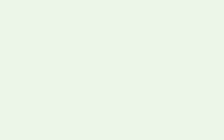

# Geräte

Die Seite Geräte listet registrierte Geräte und ihren aktuellen Zustand auf:
Name, Plattform, Besitzer, Gruppe, letzter Check-in und Status. Ein Hinweis
kennzeichnet Geräte, die nicht konform sind.

## Liste filtern

Verwenden Sie den Plattformfilter, um die Liste auf Android oder iOS zu
beschränken. Der Filter **Nur registrierte** blendet gelöschte und außer
Betrieb genommene Geräte aus.

Das Suchfeld durchsucht Gerätename, Seriennummer und Besitzer.

## Mehrere Geräte bearbeiten

Markieren Sie Geräte über die Kontrollkästchen, dann:

- **In Gruppe verschieben** verschiebt sie in die daneben gewählte Gruppe.
- **Befehl senden** sendet allen einen Befehl. Siehe Gerätebefehle.
- **Außer Betrieb nehmen** entfernt sie aus der Verwaltung. Nur Administratoren
  sehen diese Schaltfläche.

## Liste exportieren

**Als CSV exportieren** lädt die Liste mit dem aktuellen Filter herunter.

Ein Klick auf den Namen eines Geräts öffnet seine Detailseite.
